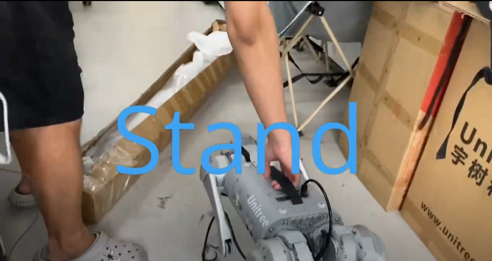

#  RL_LOCOMOTION For Go1-NX

This repo builds on the code from [vision_locomotion](https://github.com/antonilo/vision_locomotion)

## Usage
Completely follow the steps of the original warehouse for installation

`First:`If you want to build this repo, please note that change the [path](./controller/CMakeLists.txt) in line 8 and 22,23, which is your torch package

`Second:`

`tips:`There may be a `touch` issue, like:
```
agile_locomotion::AgileLocomotion::loadParameters()': agile_locomotion.cpp:(.text+0x751): undefined reference to 
```
as the installed version of `c-torch` is older. You can refer to [this](https://github.com/antonilo/vision_locomotion/issues/2) to solve the problem you are encountering.

## Change
### First
Change the control library version of a1 to go1


### second
Correcting [header files](./controller/include/) and [CMakeList.txt](./controller/CMakeLists.txt)


## Results
Finally, the code was successfully deployed on go1, achieving standing, walking, and obstacle crossing.

see:
[](https://youtu.be/enUWW-HN4iI?si=hKq9QN-5COx_rRit)

